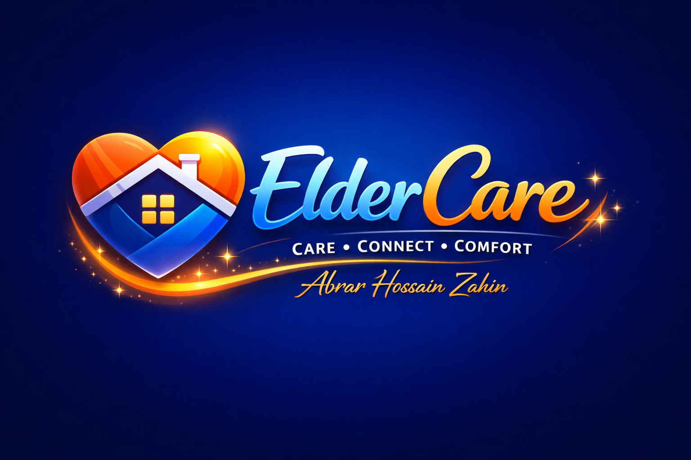

# 🧡 ElderCare — SuperApp Project Full Attractive Forntend
**Care · Connect · Comfort**

[](LICENSE)
[](#)
[](#)
[](#contributing)
[](#)

---

<p align="center">
  
</p>


**ElderCare** is a professional, full-stack eldercare superapp that integrates caregiving, medication management, co‑living, unified health records, mentoring, nutrition, telehealth, community activities and a rewards system into a single, seamless ecosystem for seniors, families, caregivers, mentors and admins.

---

## 🚀 Quick links
- **Figma brand & UI frames**: `Logo/Icon`, `GC_Main`, `D01_ActivityLog`, `A02_Admin_Dashboard` (use the Figma command list supplied in the design doc)
- **Key pages**: Dashboard, GoldenCare (mentors), NutriSenior (meals), SilverBox (meds), Care360 (EHR), TeleHealth, AgeWell Living, Activity Log, Admin Console
- **Local assets**: see `/mnt/data` for supplied logo & UI preview PNGs in this workspace

---

## ✨ Highlights & Design Goals
- One single app for seniors + their families: reduced fragmentation, better outcomes.
- Deep integration between modules: e.g., missed medication → caregiver alert → activity log → Care360 entry.
- Strong admin & audit model: role-based permissions, audit logging, impersonation for troubleshooting (fully auditable).
- Senior-first UX: large tap targets, accessible typography, high-contrast colors, simple language.
- Figma-first design system: tokens, component library, and exact frame names for developer handoff.

---

## 📦 Modules & Features (At-a-glance)
| Module | Core feature set |
|---|---|
| ElderLink | Find & book caregivers, chat, booking history, background checks |
| SilverBox | Medication reminders, IoT adherence logs, device telemetry |
| AgeWell Living | Co-living management, room booking, community events |
| Care360 | Unified EHR for seniors — records, uploads, sharing with consent |
| GoldenCare Jobs | Mentor marketplace: search, book, message, mentor onboarding |
| NutriSenior | Custom meal plans, dietitian consults, delivery + tracking |
| TeleHealth | Video & chat consults with doctors (WebRTC) |
| Community & Activities | Events, RSVP, groups, virtual classes |
| Rewards & Loyalty | Points, referrals, redeem for services/discounts |
| Admin Console | User & partner management, audit logs, security center |

---

## 🎨 Brand & Assets
Design tokens:
- **Primary**: `#4A90E2` | **Accent**: `#FFA726` | **Dark**: `#1F2D3D`
- Typography: *Poppins* (brand) + *Inter* (UI)

Included assets in this workspace:
- `/mnt/data/A_digital_illustration_logo_for_ElderCare_is_pre.png` — high-fidelity logo preview (use in marketing / splash)
- `/mnt/data/A_collection_of_digital_user_interface_(UI)_design.png` — UI preview + components layout

> To import into Figma: File → Place image, or paste the SVGs provided earlier into a frame and convert to components.

---

## 🛠 Tech Stack (recommended)
- **Frontend**: React + TypeScript, Tailwind (utility-first CSS), React Router
- **Backend**: Node.js (NestJS) or Django REST Framework
- **DB**: PostgreSQL (+ TimescaleDB for device telemetry optional)
- **Realtime**: WebSockets + WebRTC for video
- **Storage**: S3-compatible object store
- **Auth**: JWT + refresh tokens, Argon2 password hashing, OTP for BD phone
- **CI/CD**: GitHub Actions → Docker → Kubernetes (GCP/AWS)

---

## 📡 Example routes & API (short)
**Frontend routes**:
```
/                 → Dashboard
/activity-log     → Activity Log
/goldencare       → GoldenCare (mentors)
/goldencare/mentors/:id
/nutrisenior/menu
/silverbox/meds
/care360/records
/admin             → Admin Console (desktop)
```
**Important API examples**:
```
GET /api/activity-log?userId=&from=&to=&module=&severity=&q=
POST /api/bookings { user_id, mentor_id, slot_iso, mode }
POST /api/auth/request-otp { phone }
POST /api/records { file, meta }
POST /api/admin/audit { actor, action, subject, metadata }
```

---

## 🔐 Auth & Security (short)
- Phone normalization for Bangladesh: `^(?:\+8801|01)[0-9]{9}$` → store as E.164 `+8801...`
- Passwords: Argon2 recommended
- OTP: 6-digit, expire 5 minutes, max 3 attempts
- Admin-sensitive actions require 2FA / re-auth
- Full audit logging to `/api/admin/audit` with actor/action/subject/metadata

---

## 🧭 Figma / Handoff notes (copy-paste ready)
- Use **exact frame names** for mapping prototype → app:
  - `D01_ActivityLog`, `GC_Main`, `GC_MentorProfile`, `EL01_SearchResults`, `NS01_MenuOverview`, `SB01_MedsOverview`, `C360_RecordsList`, `A02_Admin_Dashboard`
- Add `data-figma-target` attributes on interactive CTAs during dev prototype build to connect to frames
- Export icons as SVG, images as PNG 2x for retina

---

## 🧪 Local dev — Quickstart (example)
```bash
# clone
git clone <repo-url> eldercare && cd eldercare

# frontend
cd frontend
pnpm install
pnpm dev

# backend (new terminal)
cd backend
pnpm install
pnpm dev
```

Open `http://localhost:3000` for the frontend app (dashboard) and `http://localhost:3000/activity-log` to test the Activity Log.

---

## ✅ Contribution & PR guideline (short)
- Branch: `feat/<module>-short`, `fix/<issue>-short`
- Tests required for backend changes and major frontend flows
- PR template: description, screenshots, affected frames (Figma), migration notes
- Code style: Prettier + ESLint (TS rules), commitlint (conventional commits)

---

## 📅 Roadmap (TL;DR)
**MVP (0–3 months)**: Dashboard, ElderLink, Care360, Auth (email + BD phone OTP), SilverBox pilot, NutriSenior pilot.  
**Phase II (3–9 months)**: GoldenCare Jobs, TeleHealth, Activity Log, Admin console.  
**Phase III (9–18 months)**: AgeWell Living franchises, insurer partnerships, internationalization.

---

## 🧾 License & Contact
**License:** MIT — add a LICENSE file in repo root.  
**Author / Owner:** Abrar Hossain Zahin — include your preferred contact email in `package.json` and repo settings.

---

## 📥 Download-ready assets in this workspace
- Logo preview: `/mnt/data/A_digital_illustration_logo_for_ElderCare_is_pre.png`  
- UI preview: `/mnt/data/A_collection_of_digital_user_interface_(UI)_design.png`

---

## ❤️ Thanks
Thanks for building a compassionate product for older adults — if you want, I can also:
- produce a GitHub README with **animated badges**, **social links**, and a **demo GIF**, or
- generate a one-page **landing page HTML** with this branding and exported images.

---

# ElderCare-SuperApp
A Unified Platform for Bangladesh's Elderly Crisis (Prototype)
## Figma Prototype Link: https://motto-truck-48556756.figma.site
### Demo Video Link: https://drive.google.com/file/d/1s6sIHRpsfK-G8IA0RTt6YToHT3oIBvgO/view?usp=sharing
